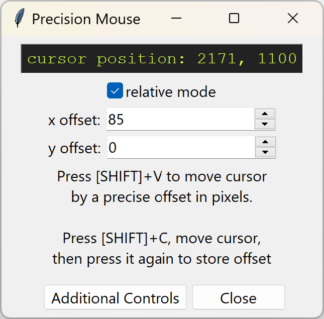

# precision-mouse

[Click here to download the latest version!](https://github.com/GreenBeansAgainstVeganism/precision-mouse/releases/latest/download/precision_mouse.exe)

 
A small utility I wrote in Python with Tkinter to allow users fine control over their mouse cursor position. Most of the utility of this tool can be achieved with any standard auto-clicker or macro recorder program but this tool was specifically designed for map making in Bloons Tower Defense 6, so it offers a simpler workflow for a particular set of actions.

Features:
- Move your mouse cursor by a precise offset in pixels
- Move your mouse cursor to a exact position on screen
- Nudge your mouse cursor using the arrow keys for fine adjustments
- Use a keyboard shortcut to simulate clicking without having to touch the mouse

As of the creation of this tool, the BTD6 map editor UI does not allow players to easily make fine adjustments which makes designing certain maps extremely frustrating. This tool makes it easier to do 2 things mainly: position props and other map elements at exact locations relative to one another, and adjust the sliders on props to achieve mathematically exact rotations. Examples of what is achievable can be found below:

